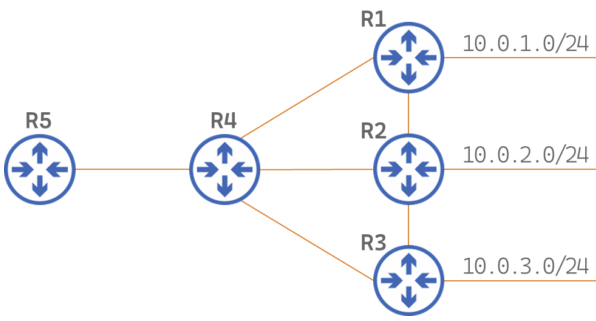
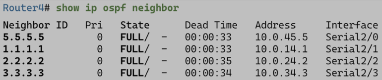
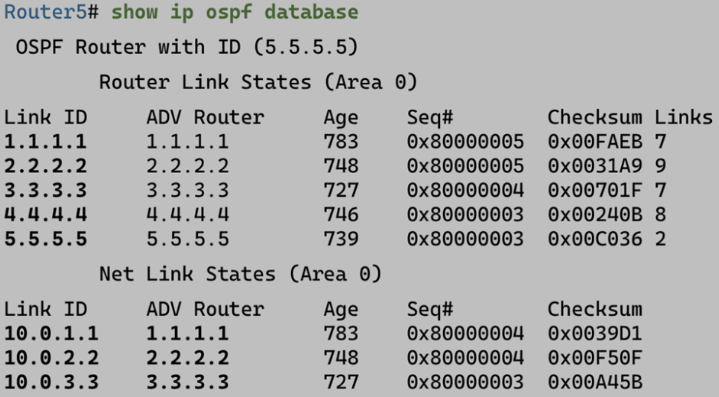

# OSPF. Phase I - структура и этапы работы

OSPF пришел в мир для того, чтобы заменить RIP и его метрику оптимального маршрута, основанную на количестве прыжков до сети назначения. От RIP выгодно отличается более быстрой сходимостью и удобством масштабирования при помощи разделения сети на зоны.

## Компоненты протокола

Протоколы маршрутизации в силу своей задачи имеют некоторую общую структуру, OSPF в данном случае не является исключением. OSPF состоит из:

- **Сообщения OSPF** - используются маршрутизаторами для обмена информацией о маршрутах и проверки их актуальности:

    - **пакеты Hello**
    - **пакеты DBD** (Database Description)
    - **пакеты LS(A/U/R/Ack)** (Link-State Advertisement/Update/Request/Acknowledgement)

- **Структуры данных** - на основе сообщений собираются базы, на основе которых расчитываются маршруты и принимаются решения о маршрутизации пакетов. Рассмотрим на примере следующей топологии.

    

    - **ADB (Adjacency Database)** - **таблица смежности**, содержащая роутеры, с которыми установлен двухсторонний обмен (TWO-WAY). **Уникальна** для каждого роутера.

    

    - **LSDB (Link-State Database)** - **таблица состояния каналов**, она же таблица топологии, в которой содержится информация о всех маршрутизаторах в сети. **Общая** для всех роутеров (в идеале, если успевает синхронизироваться). Посмотреть: `show ip ospf database`.

    

    - **FDB (Forwarding Database)** - **таблица маршрутизации**, **уникальна** для каждого роутера. Посмотреть: `show ip route`.

    
    
- **Алгоритм** - Shortest Path First (SPF), он же алгоритм Дейкстры, он же алгоритм нахождения кратчайших путей от одной вершины до всех прочих. В OSPF он обсчитывается на каждом роутере, на основе чего составляется дерево SPF, в дальнейшем использующееся для определения лучших маршрутов для таблицы маршрутизации.

## Этапы работы протокола или набросок OSPF за 5 минут

1. **Роутеры рассылают hello-пакеты** из всех интерфейсов, на которых включен OSPF, и устанавливают отношения смежности с соседями.
2. **Смежные роутеры обмениваются данными о состоянии каналов** при помощи лавинной (flood) рассылки LSA R1 посылает LSA всем своим соседям, R2 получает LSA и если он не дублируется существующим, пересылает его всем своим соседям и так до тех пор, пока все маршрутизаторы не получат все LSA.
3. После получения объявлений LSA **каждый роутер создает базу данных топологии LSDB**. Если ему встретится незнакомая запись, то он запросит информацию о ней при помощи пакета LSR, на что целевой роутер ответит пакетом LSU с необходимой информацией.
4. **Каждый маршрутизатор выполняет алгоритм SPF, находя кратчайшие пути к каждой сети** и создавая дерево кратчайшик путей SPF.
5. **На основе своего дерева SPF каждый маршрутизатор добавляет маршруты в таблицу маршрутизации**, если отсутствует маршрут к той же сети с меньшим административным расстоянием, например статический.