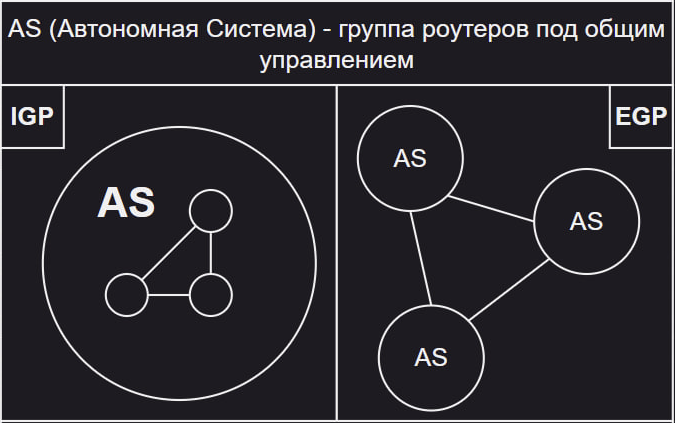
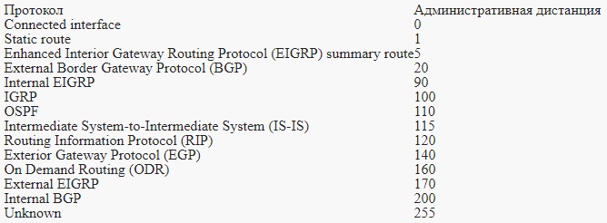

# Пару слов о динамической маршрутизации

Статическая маршрутизация - та, в которой мы прописываем маршруты пакетов к сетям вручную.

Динамическая маршрутизация - маршрутизация, при которой за заполнение маршрутной таблицы отвечают протоколы, при помощи которых роутеры самостоятельно изучают сеть.

Протоколы маршрутизации можно разделить на два вида:

- **IGP (Interior Gateway Protocols) / Протоколы внутренней маршрутизации** - протоколы, работающие в пределах одной автономной системы.
- **EGP (Exterior Gateway Protocols) / Протоколы внешней маршрутизации** - протоколы, работающие между несколькими автономными системами.

Зачем нам динамическая маршрутизация:

- **Отказоустойчивость** - в случае отказа одного из маршрутов, роутеры с настроенным протоколом динамической маршрутизации перестроят свои таблицы маршрутизации в обход разрыва.
- **Масштабируемость** - при добавлении нового роутера в сеть нам понадобится всего лишь включить соответствующий протокол и прописать пару параметров вместо того, чтобы прописывать все необходимые маршруты руками.
- **Балансировка трафика** - обычно динамические протоколы из коробки умеют распределять нагрузку между маршрутами.

## Внутренние протоколы маршрутизации (IGP)

Внутренние протоколы маршрутизации в свою очередь можно разделить на:

- **Дистанционно-векторные / Distance-Vector** 
- **Состояния связей / Link State**

Три коренных различия между видами:

- Дистанционно-векторные обмениваются **таблицами маршрутизации**, а протоколы состояния связей - **таблицами топологии**.
- Процессом выбора лучшего маршрута.
- Роутеры в дистанционно-векторных протоколах **знают только своих соседей**, в протоколах состояния связей каждый роутер **обладает информацией обо всей сети**.

## Словарик

- **Автономная система / Autonomous System (AS)** - совокупность маршрутизаторов, находящихся под единым административным контролем.
- **Административное расстояние / Administrative Distance** - некоторое значение от 0 до 255, присваиваемое способу задания маршрута, выражающее степень "доверия" к нему и определяющее его приоритетность - чем меньше значение, тем выше приоритет. Cisco предоставляет следующую таблицу:

    

## Сходимость

Важным понятием алгоритмов маршрутизации является сходимость.

**Сходимость** - процесс согласования маршрутизаторами информации об изменившейся топологии сети.

**Алгоритм считается "сошедшимся"** в момент, когда все причастные маршрутизаторы имеют актуальную информацию о маршрутах.

Время сходимости является важным фактором, так как во время этого процесса сеть особо уязвима к проблемам маршрутизации в силу того, что некоторые маршрутизаторы не закончили перерасчеты и обладают неполной или ошибочной информацией о состоянии сети.