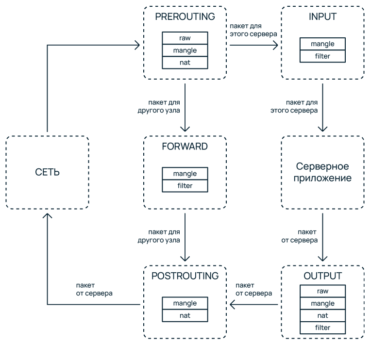
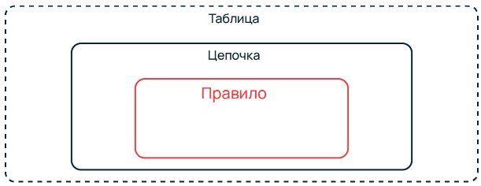

## Путь прохождения пакетов:



## Структура iptables
Таблицы содержат цепочки, цепочки содержат списки правил.

> Таблицы содержат цепочки, цепочки содержат списки правил.
> **ТАБЛИЦА**->**Цепочки**->**списки правил**



> Важно понимать, что **СТРУКТУРА iptables ОТЛИЧАЕТСЯ от ДИАГРАММЫ прохождения пакетов**. Из диаграмы может показаться, что таблица POSTROUTING содержит в себе цепочки raw, mangle и nat, однако на самом деле это таблицы raw, mangle и nat содержат в себе цепочки POSTROUTING.

## Структура команд

```bash
iptables таблица команда цепочка критерий действие
```

## Цепочки

5 видов цепочек:

- **PREROUTING**
- **INPUT**
- **FORWARD**
- **OUTPUT**
- **POSTROUTING**

## Таблицы

5 видов таблиц:

- **raw**: PREROUTING, OUTPUT
- **mangle**: ALL
- **nat**: PREROUTING, OUTPUT, POSTROUTING
- **filter**: INPUT, FORWARD, OUTPUT
- **security**: INPUT, OUTPUT, FORWARD

## Действия

- ACCEPT, DROP, REJECT
- LOG, ULOG
- MARK, CONNMARK
- QUEUE
- RETURN
- DNAT, SNAT, MASQUERADE, REDIRECT
- TOS, TTL
