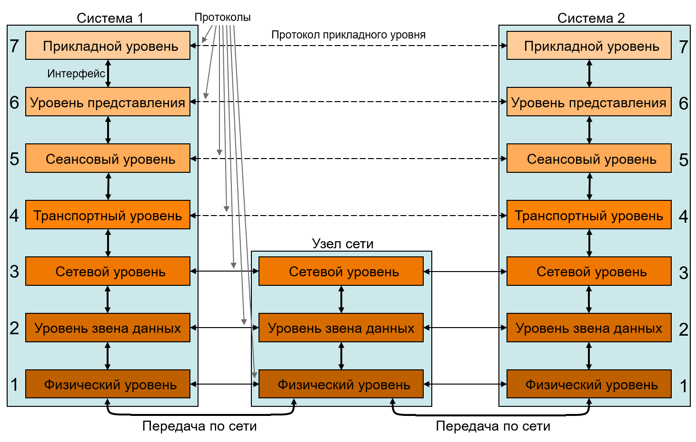
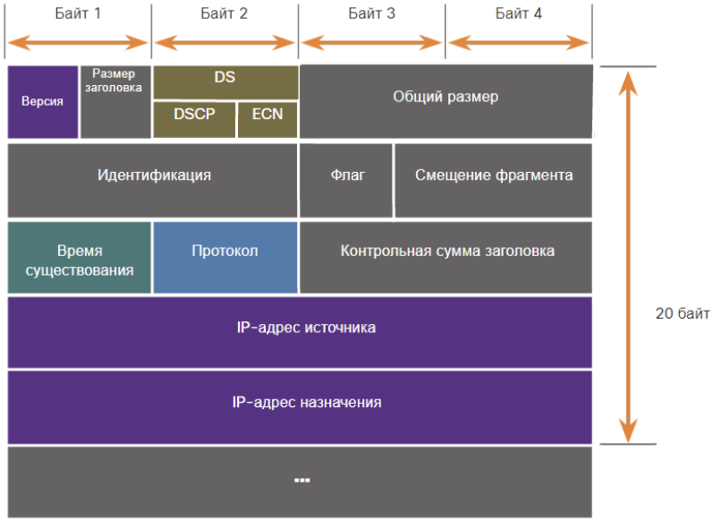

# Модель OSI

Старая, добрая, семиуровневая. Известная и как **Эталонная Модель Взаимодействия Открытых Систем (ЭМВОС)**, и как **Open Systems Interconnection (OSI)**.

## Словарик

**Открытая система** - любая систем, готовая к межсетевому взаимодействию с другими системами.

**Протокол** - набор правил, виды сообщений и их последовательность, по которым происходит взаимодействие между системами на одном уровне.

**Интерфейс** - набор правил, виды сообщений и их последовательность, по которым происходит взаимодействие между уровнями одной системы.

**Служба** - набор услуг, предоставляемых нижним уровнем верхнему.

**Инкапсуляция** - процесс помещения одного сообщения в другое. Пример концепта: помещение письма в конверт с целью его доставки по адресу назначения.

## Смысл существования

Модель нужна чтобы описать минимально необходимый функционал для осуществления сетевого взаимодействия между системами. Она создана таким образом, чтобы собрать его в обособленные логические уровни - таким образом, пока предоставляемая уровнем служба соответствует интерфейсу с вышестоящим уровнем, детали реализации могут отличаться. Это позволяет различным разработчикам и вендорам внедрять собственные решения для конкретных уровней модели и таким образом конкурировать между собой.

## Принцип действия

Взаимодействия между системами можно рассматривать с "вертикальной" и "горизонтальной" точки зрения.

**С "вертикальной" точки зрения** на уровне приложения формируется пользовательский запрос, после чего полученная информация преобразовывается и инкапсулируется в форматы сообщений данного уровня по мере продвижения вниз по уровням. На физическом уровне полученная информация преобразуется в битовый поток, подготавливается для передачи по среде и отправляется системе-получателю, на который полученный поток заново преобразуется в информацию и затем идет вверх по уровням, деинкапсулируясь и преобразовываясь в человекочитаемый вид на уровне приложений.

**С горизонтальной точки зрения** происходит взаимодействия по различным протоколам: устанавливается связь и передаются данные по протоколу TCP, обмениваются сообщениями клиенты и сервера по протоколу HTTP.

## Об уровнях

- **Физический** - отвечает за адаптацию потока битов к свойствам сред передачи при помощи механических (конструкции разъемов, кабелей и т.д.), электрических (поддержание необходимого уровня сигнала и других физических характеристик) и процедурных (линейное биполярное кодирование, модуляция/демодуляция и т.д.) средств.
- **Канальный** - отвечает за подготовку данных к физической среде и связь сетевых карт (NIC) между собой. Если раскрывать, то состоит из двух подуровней:
    - **Logical-Link Control (LLC)** - обеспечивает взаимодействие ПО верхних уровней и аппаратного обеспечения нижнего, в частности помещает в кадр информацию о протоколе сетевого уровня. Описан стандартом IEEE 802.2
    - **Media Access Control (MAC)** - отвечает за доступ к среде передачи, адресацию, инкапсуляцию данных (за поля кадра,контрольную сумму) и интеграцию с различными технологиями физического уровня: Wi-Fi (IEEE 802.11), Ethernet (IEEE 802.3), Bluetooth ((IEEE 802.15)) и т.д.
- **Сетевой** - отвечает за адресацию устройств в сети, инкапсуляцию данных транспортного уровня и маршрутизацию PDU от источника к назначению.
- **Транспортный** - отвечает за взаимодействие между конкретными сервисах на устройствах источника и назначения: отслеживает сеансы связи, сегментирует и десегментирует отправляемую информацию, определяет приложениями, мультиплексирует сеансы связи.
- **Сеансовый** - отвечает за поддержание сеансов связи между приложениями устройств источника и назначения: инициализация и завершение диалога, перезапуск сессий после бездействия или сбоя.
- **Представления** - отвечает за форму информации: формат для правильного приема на устройстве назначения, ее сжатие и разжатие, шифрование и дешифрование. **Именно тут определяются файловые форматы**.
- **Приложения** - отвечает за обмен данными между программами, работающими на хостах источника и назначения. Предоставляет пользователю интерфейс для отправки запросов на удаленную машину. Предоставляет интерфейс между приложением и сетью.

## Кадр Ethernet (IEEE 802.3)

| **Преамбула** | **SFD**    | **DA**     | **SA**     | **LI/Ethertype**   |**Data**         | **FCS**     | **EFD** |
|---------------|------------|------------|------------|--------------------|-----------------|-------------|---------|
| 7 байт        | 1 байт     | 6 байт     | 6 байт     | 2 байта            | 46-1500 байт    | 4 байта     | 1 байт  |

- **Преамбула** - **отвечает за L1-синхронизацию**, дает приемнику понять, что нужно ожидать дальнейшей передачи.
- **SFD (Starting Frame Delimiter)** - **отвечает за L2-синхронизацию**,  указывает на начало приема кадра, состоит из последовательности 101010...
- **DA (Destination Address)** - **указывает на MAC-адрес** сетевой карты источника.
- **SA (Source Address)** - **указывает на MAC-адрес** сетевой карты источника.
- **LI/Ethertype** - если тело меньше 1500 байт, то LI - **длина поля данных**, иначе - указатель на **тип инкапсулированного протокола** 3его уровня.
- **Data** - полезная нагрузка кадра.
- **FCS (Frame Check Sequence)** - **контрольная сумма кадра**, полином CRC-32.
- **EFD (Ending Frame Delimiter)** - ограничитель, указывающий на **конец кадра**.

## Пакет IPv4

- **Версия** - версия протокола IPv4.
- **Дифференцированные сервисы (DS) /** устаревшее: Тип сервиса (ToS) - используется для обеспечения QoS посредством определения приоретета пакета. Первые 6 бит - поля дифференцированных услуг (DSCP), оставшиеся 2 - биты явного уведомления о заторах(ECN).
- **Размер заголовка, общий размер, контрольная сумма заголовка** - используются для определения и проверки пакета (поиск ошибок в ТОЛЬКО в заголовке).
- **Идентификация, флаги, смещение фрагмента** - используются для фрагментации пакета IPv4.
- **Время существования** - 8 бит, определяющие количество хопов, которые пройдет пакет прежде чем быть уничтоженым.
- **Протокол** - 8 бит, идентифицирующие инкапсулированный протокол транспортного уровня.
- **Адрес источника, адрес назначения** - IP-адреса источника и назначения.

