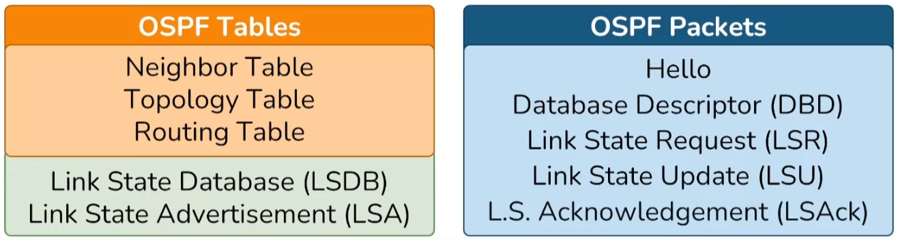
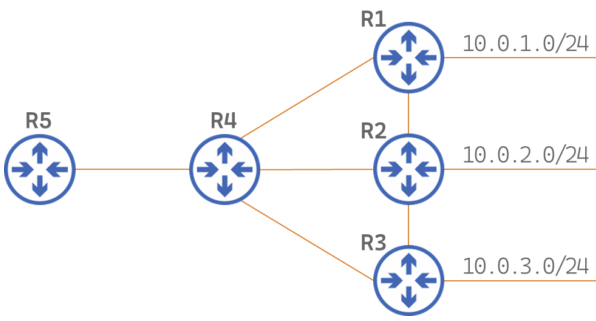
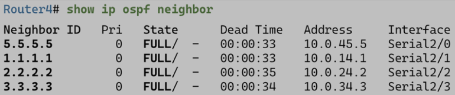

# OSPF. Интерлюдия

Здесь я отчаялся и перешел на видео, поэтому пришло время подставить лицо под качественный перевод технических видео.

## Фреймворк OSPF

Можно сказать, что **фреймворк OSPF состоит из таблиц и пакетов**. Кроме того, к таблицам относятся два важнейших термина OSPF: **Link State Database (LSDB) и Link State Advertisement (LSA)**.

## Таблицы OSPF

Посмотрим на следующую топологию:

- **Neighbor Table:**

    - Содержит список напрямую подключенных роутеров-соседей.
    - Содержит информацию об отношениях смежности

- **Topology table:**

    - Содержит все, что OSPF знает о сети.
    - Является идентичной на всех роутерах автономной системы (в идеальном случае, при схождени алгоритма).
    - В OSPF таблица топологии носит название Link State Database (LSDB). Каждая запись в LSDB называется Link State Advertisement (LSA).

- **Routing Table:**

    - Является неотъемлемой функцией роутера, а не OSPF
    - OSPF присылает сюда лучшие найденные маршруты

## Пакеты

- **Hello-пакеты:**
    - периодически рассылаются при помощи многоадресной рассылки OSPF на адрес 224.0.0.5
    - обнаруживают другие OSPF-роутеры
    - передают информацию о конфигурации OSPF, что определяет результат попытки установления смежности

- **Database Descriptor (DBD):**
    - содержит краткое описание LSDB
    - LSDB состоит из LSA
    - Чтобы избежать накладной рассылки LSDB целиком каждому соседу, используют DBD

- **Link State Request (Link State Request):**
    - Отправляется чтобы запросить одну или несколько LSA

- **Link State Update (Link State Update):**
    - Доставляет одну или несколько LSA

- **Link State Acknowledgement (LSAck) :**
    - Подтверждают доставку LSU

Все эти пакеты участвуют в подключении нового роутера: сначала с ним устанавливают отношения смежности при помощи Hello-пакетов, затем его уведомляют о состоянии LSDB при помощи DBD. Потом происходит обновление его собственной таблицы при помощи LSR-LSU-LSAck.

Когда возникает какое-то изменение в топологии, то роутер уведомляет об этом всех остальных при помощи LSU.

Чтобы удостовериться в работоспособности соседей, роутер периодически рассылает им Hello-пакеты и ожидает ответа.