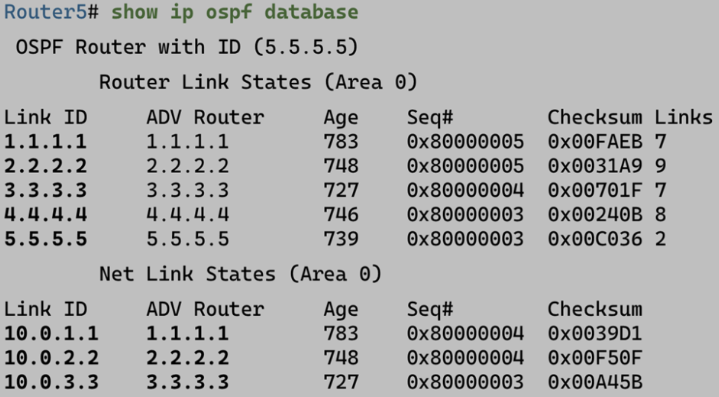
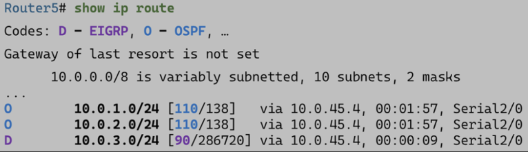

# OSPF. Интерлюдия

Здесь я отчаялся и перешел на видео, поэтому пришло время подставить лицо под качественный перевод технических видео.

## Фреймворк OSPF

Можно сказать, что **фреймворк OSPF состоит из таблиц и пакетов**. Кроме того, к таблицам относятся два важнейших термина OSPF: **Link State Database (LSDB) и Link State Advertisement (LSA)**.

## Таблицы OSPF

Посмотрим на следующую топологию:

- **Neighbor Table:**

    - Содержит список напрямую подключенных роутеров-соседей.
    - Содержит информацию об отношениях смежности

- **Topology table:**

    - Содержит все, что OSPF знает о сети.
    - Является идентичной на всех роутерах автономной системы (в идеальном случае, при схождени алгоритма).
    - В OSPF таблица топологии носит название Link State Database (LSDB). Каждая запись в LSDB называется Link State Advertisement (LSA).

- **Routing Table:**

    - Является неотъемлемой функцией роутера, а не OSPF
    - OSPF присылает сюда лучшие найденные маршруты

