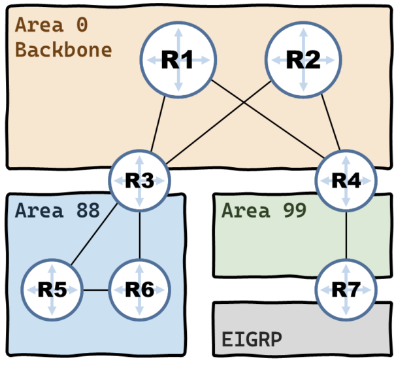

# Глава 2: о зонах и видах роутеров

Зачем мы разбиваем сети OSPF на зоны? Посмотрим на следующую топологию:

Главная мысль:

- Роутеры OSPF поддерживают идентичность своих LSDB:
    - Из этого следует, что даже самое незначительное изменение топологии приводит к оповещению ВСЕХ роутеров сети.

**I)** Если канал между R5 и R3 выйдет из строя, то R3 выберет обходной путь через R6. Казалось бы, все хорошо, однако в таком случае ради поддержания единой LSDB он передаст информацию об изменении топологии своим соседям, а они в свою очередь распространят ее на остальные роутеры. Это вызовет перерасчет кратчайшего маршрута. 

Когда маршрут будет восстановлен - эта процедура повторится. Не очень практично.

**II)** Взглянем на роутер R3 - у других роутеров просто нет других маршрутов, чтобы добраться до заданной сети. Это значит, что им нет смысла знать о всех изменениях, происходящих за его пределами.

Исходя из эти соображений мы делим сеть на зоны:

- Сети можно сегрегировать при помощи зон:
    - Зоны позволяют нам ограничить рассылку информации об изменениях топологии своими пределами.
- Зоны предоставляют нам двухуровневый иерархический дизайн:
    - Зона 0 - вершина иерархии - магистральная (Backbone area)
    - Зона N - все остальные зоны
- Трафик между зонами обязательно должен пересекать магистральную зону:
    - Это сделано для того, чтобы избежать петель маршрутизации
    - Отсюда получается, что топология OSPF - это звезда

##  Роли роутеров

На предыдущей картинки мы можем созерцать буквально все виды роутеров.

- **Внутренние роутеры (Internal Routers)** - роутеры, имеющие все интерфейсы в одной зоне. На рисунке: R5, R6.
- **Магистральные роутеры (Backbone Routers)** - роутеры, имеющие как минимум 1 интерфейс в магистральной зоне. На рисунке: R1, R2, R3, R4.
- **Пограничные роутеры зон (Area Border Routers)** - роутеры, имеющие интерфейсы в 0ой и другой зоне. На рисунке: R3, R4.
    - Поддерживает LSDB для каждой из зон.
    - Передают LSA между зонами.
- **Пограничные роутеры автономных систем (Autonomous System Border Routers)** - роутеры, предоставляющие маршруты от автономных систем с другими протоколами маршрутизации, статическими маршрутами, directly connected. На рисунке: R7.