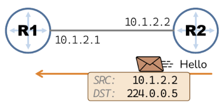
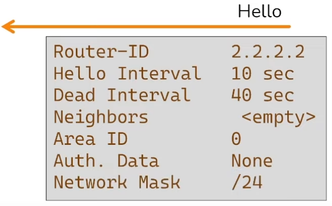
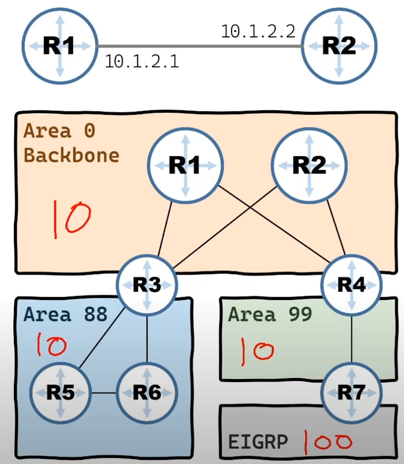
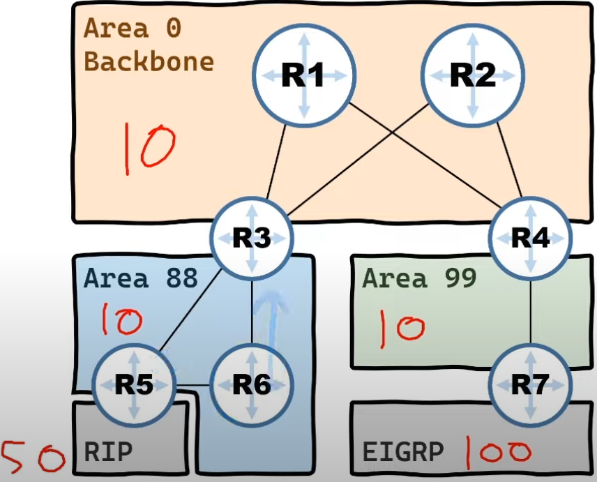
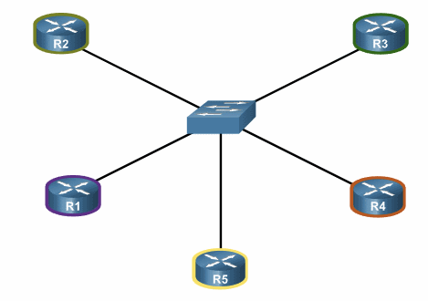

# Глава 3: о hello-пакетах, типах зон и DR/BDR

Hello-пакеты занимаются следующими вещами:

- Обнаруживают соседей по OSPF.
- Рассылаются по мультикаст адресу OSPF 244.0.0.5.
- Если сеть не поддерживает мультикаст, то каждому OSPF-интерфейсу в ручную.назначаются адреса и пакеты прилетают по юникасту.
- Своим содержимым определяют, смогут ли роутеры стать соседями по OSPF.

## Содержимое hello-пакета

Пакет содержит некоторые поля, но не все из них должны совпадать для установления отношения смежности.

Необходимые для установления смежности поля:

- **Router-ID** - идентификатор роутера, адрес с маской 32.
- **Hello Interval** - интервал, через который рассылаются пакеты.
- **Dead Interval** - интервал, после которого сосед считается умершим.
- **Neighbors** - список соседей отправляющего, подтверждает получение пакета соседом.
- **Area ID** - идентификатор зоны, роутеры должны находиться в одной зоне.
- **Auth Data** - поле для парольной аутентификации членов сети.
- **Network Mask** - интерфейсы должны находиться в одной сети.

## Виды зон

Существует три вида зон. Основной отличительной чертой является их отношение к редистрибуции маршрутов из других автономных систем:

- **Normal Area** - редистрибутирует маршруты из других автономных систем. 10+10+10+100=130 маршрутов (см. рисунок).
- **Stub Area** - не редистрибутирует маршруты из других автономных систем, компенсируя это маршрутом по умолчанию. 10+10+10+1=31 маршрутов (см. рисунок).
- **Not So Stubby Area** - редистрибутирует маршруты, но только из локальной автономной системы, опционально заменима маршрутом по умолчанию. 50+10+10+10=80 маршрутов (см. рисунок 2).

Поменяем нашу топологию для иллюстрации NSSA:

По умолчанию зона является Normal. Все отличные от нее созданы для того, чтобы экономить на редистрибуции ненужных маршрутов от автономных систем.

## DR и BDR

Возвращаясь к Hello-пакетам, у нас есть еще три поля, которые не должны совпадать для установления отношения смежности:

- **DR** - Designated Router.
- **BDR** - Backup Designated Router.
- **Priority** - 0-255, по дефолту 1.

Эти два роутера нужны затем, чтобы избежать широковещательного флуда LSA:

Когда R2 получает какое-то обновление топологии, то он рассылает всем своим соседям пакеты LSA. Когда роутеры получают их, они в свою очередь начинают заниматься тем же - это может привести к огромному LSA-шторму.

Чтобы исправить это, в рамках сети OSPF выбираются два роутера, отвечающие за обновление топологии: Designated и Backupd Designated роутеры. Первый занимается этим во всех штатных ситуациях, а второй подменяет его в случае неполадок.

DR и BDR выбираются в сетях множественного доступа, но **ЕСТЬ ОДИН НЬЮАНС**. Сетью множественного доступа у OSPF считается **ЛЮБОЙ ЛИНК**, имеющий потенциал стать таковым. То есть прямой Ethernet-канал между двумя роутерами **ТОЖЕ СЧИТАЕТСЯ**.