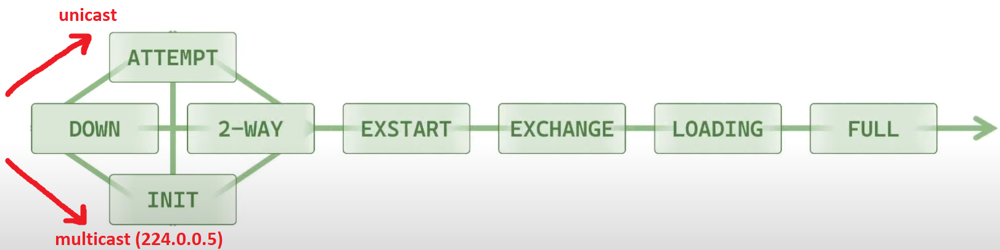
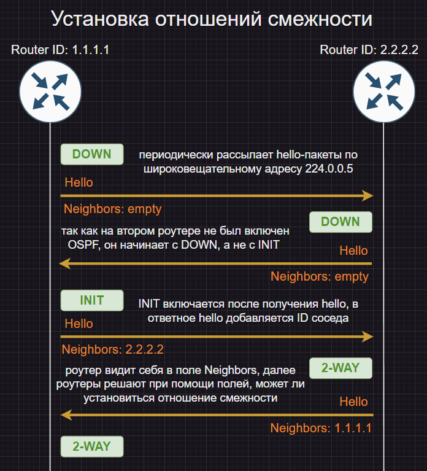
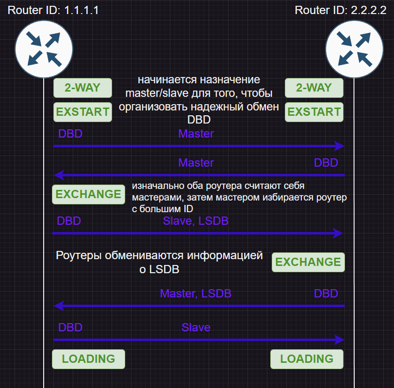
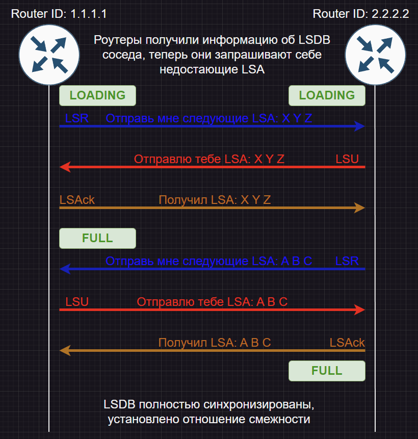

# Глава 4: об установлении смежности

Вспомним о том, какие пакеты применяются в OSPF:

- **Hello-пакеты** - для установления отношений смежности
- **DBD** - для передачи общей информации о базе топологии
- **LSU** - передача поля из базы топологии
- **LSR** - запрос поля из базы топологии
- **LSAck** - подтверждение получения LSU

Содержимое Hello-пакетов. **Выделим те**, которые должны совпадать для установления зависимости:

- Router ID
- Neighbors
- **Area ID**
- **Hello Interval**
- **Dead Interval**
- **Authentication**
- **Network Mask**
- Area Type
- DR
- BDR
- Priority

Диаграма состояний установления отношений смежности выглядит следующим образом:

## Установка отношений смежности. I этап

> **Важное замечание:** состояния, которые мы здесь видим, это состояния отношений смежности, а не роутеров.

> **Касательное состояния ATTEMPT:** оно имеет место только в случае недоступности широковещательной рассылки, в таком случае адрес соседа указывается вручную, пакеты hello посылаются при помощи unicast-рассылки, а таблица соседей инициализируется с готовой записью об адресе соседа.

## Установка отношений смежности. II этап

## Установка отношений смежности. III этап

