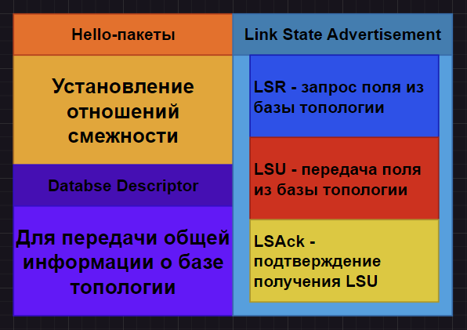
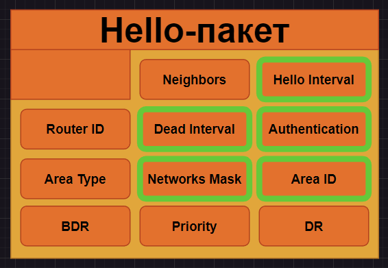

# Глава 4: об установлении смежности

Вспомним о том, какие пакеты применяются в OSPF:

Содержимое Hello-пакетов. **Выделим те**, которые должны совпадать для установления зависимости:

Диаграма состояний установления отношений смежности выглядит следующим образом:

## Установка отношений смежности. I этап

**Важное замечание:** состояния, которые мы здесь видим, это состояния отношений смежности, а не роутеров.

**Касательное состояния ATTEMPT:** оно имеет место только в случае недоступности широковещательной рассылки, в таком случае адрес соседа указывается вручную, пакеты hello посылаются при помощи unicast-рассылки, а таблица соседей инициализируется с готовой записью об адресе соседа.

## Установка отношений смежности. II этап

## Установка отношений смежности. III этап

