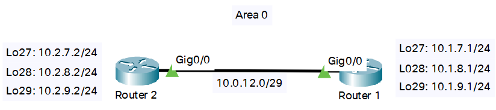

# Глава 5: о практике

Возьмем следующую топологию из одной зоны:



Посмотрим на уже настроенные интерфейсы, R1 будет настроен аналогичным образом с соответствующими адресами.

## Настройка OSPF на R1

```
R1(config)# router ospf 110 // включаем протокол, 110 - ID процесса
R1(config)# router-id 1.1.1.1 // задаем собственный ID роутера
R1# show ip protocols // проверяем настройки протокола
```

- Команда router OSPF предлагает нам выбрать ID процесса - это нужно в случае, если наш роутер является ASBR и редистрибутирует маршруты из AS, которая тоже использует OSPF.

```
R1(config)# router ospf 110 // заходим в настройки нашего процесса ospf
R1(config-router)# network 10.0.12.1 0.0.0.0 area 0 // добавляем интерфейс в ospf
R1(config-router)# network 10.1.7.1 0.0.255.255 area 0 // добавляем диапазон интерфейсов в ospf
R1(config)# show ip ospf interface // проверяем добавленные интерфейсы
```

## Настройка OSPF на R2

На втором роутере производим аналогичные настройки с поправкой на сети и ID роутера:

```
R2(config)# router ospf 110 // включаем процесс ospf
R2(config)# router-id 2.2.2.2 // задаем собственный ID
R2# show ip ospf neighbor // посмотрим, нашелся ли наш сосед
R2# show ip ospf database // посмотрим итоговую таблицу топологии
R2# show ip route ospf // посмотрим на маршруты, построенные ospf
```
## Список команд

- Настройка:
    - **router ospf** <*process_id*\> // включаем ospf
    - **router-id** <*router_id*\> // задаем свой router id
    - Добавляем интерфейсы:
        - **network** <*network_id*\> <*wildcard_mask*\> **area** <*area_number*\> // из режима (config-router)
        - **ip ospf** <*process_id*\> **area** <*area_number*\> // из режима (config-if)
- Просмотр:
    - **show ip protocols** // смотрим включенный протокол динамической маршрутизации
    - **show ip ospf interface** // смотрим интерфейсы с включенным ospf
    - **show ip ospf neighbors** // смотрим соседей по ospf
    - **show ip ospf database** // смотрим таблицу топологии
    - **show ip route ospf** /// смотрим роуты ospf