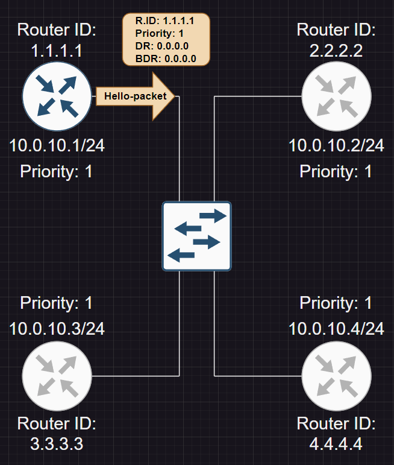
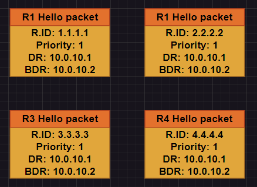
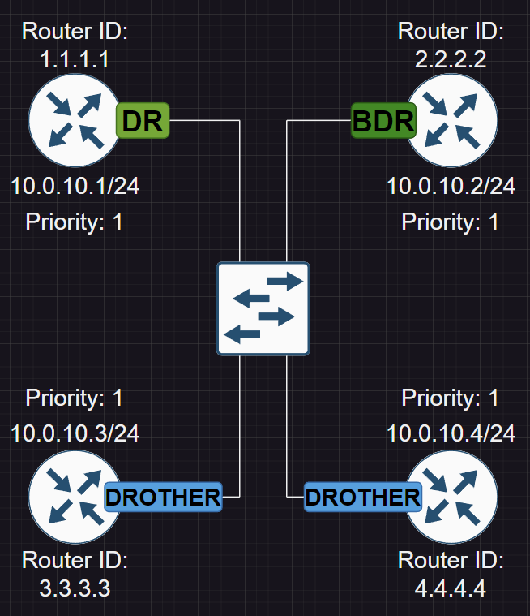
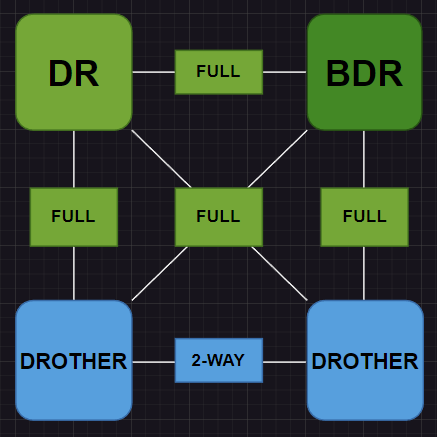
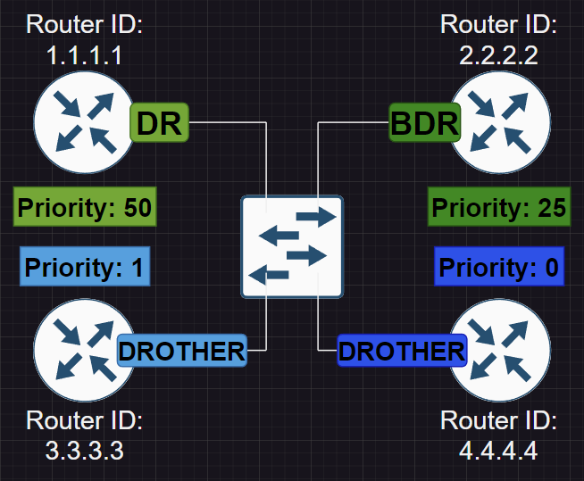

# Глава 6: о выборе DR и BDR

Вспомним пару фактов о DR и BDR:

- Они нужны для того, чтобы уменьшить количество бесполезного LSA трафика.
- Они выбираются при помощи полей Hello-пакета:
    - В первую очередь по наибольшему значению поля Priority (0-255)
    - Если Priority равны, то больший Router-ID решает
- DR/BDR выбираются в каналах множественного доступа:
    - Считаются любые каналы, имеющие потенциал к множественному доступу
    - Множественная рассылка или NBMA

## Выбор DR

Рассмотрим следующую топологию. Включим роутер 1.1.1.1:



Процесс выбора DR:

- Роутер 1.1.1.1 начинает рассылать Hello-пакеты  в поисках соседей и DR
- Это продолжается до истечения WAIT таймера, который равен Dead Interval (40 sec)
- Если DR не был обнаружен, то объявляет себя им и выставляет поле DR IP: 1.1.1.1

## Выбор BDR

Включим роутер 2.2.2.2. Процесс выбора BDR:

- Роутер 2.2.2.2 начинает рассылать Hello-пакеты в поисках соседей и DR
- Роутер 2.2.2.2 получает Hello-пакеты от 1.1.1.1:
    - Priority одинаковы, однако 2.2.2.2 имеет больший ID
    - Он не становится DR, потому что DR УЖЕ ВЫБРАН - замена DR не происходит
- Роутер 2.2.2.2 не находит BDR, поэтому объявляет себя BDR и выставляет поле BDR IP: 2.2.2.2

## Остальные роутеры

Включим роутеры 3.3.3.3 и 4.4.4.4:

- Они видят, что DR и BDR уже выбраны
- Они становятся DROTHER



Окончательное состояние нашей топологии:



## Отношения смежности

- Каждый роутер DROTHER синхронизирует свои LSDB c DR и BDR, отсюда: **DR и BDR требуют отношений FULL**
- DROTHER не синхронизируют свои LSDB между собой, отсюда: роутерам **DROTHER достаточно отношений 2-WAY**



**Статусы DR/BDR и приоритет - свойства интерфейсов. Таким образом, роутер может иметь два интерфейса, один из которых будет иметь статус DR, а другой - статус DROTHER.**

## Выбираем DR и BDR вручную

У нашей схемы есть заметный изъян: **при равных приоритетах выбор DR и BDR определяется порядком включения роутеров**. Для того, чтобы избежать этого, нам нужно вручную задать их интерфейсам приоритеты:

```
Router(config-if)# ip ospf priority [0-255]
```

Для того, чтобы сохранить текущую конфигурацию статусов, можно раздать приоритеты следующим образом:



- **Значение 0 - специальное**. Оно означает, что данный интерфейс роутера 4.4.4.4 никогда не станет DR/BDR

## Рассылка обновлений маршрутов

Есть **два адреса множественной рассылки**, которые используются OSPF:

- 224.0.0.5 - используется всеми роутерами
- 224.0.0.6 - используется DR/BDR

Возможны несколько ситуаций:

Когда **DR получает апдейт**:

- **DR** отправляет **LSU** на **224.0.0.5**
- **BDR** отправляет **LSAck** на **224.0.0.5** (для того, чтобы дать понять DROTHER, что он жив)
- **DROTHER** отправляет **LSAck** на **224.0.0.6**

Когда **BDR получает апдейт**:

- **BDR** отправляет **LSU** на **224.0.0.5**
- **DR** отправляет **LSAck** на **224.0.0.5**
- **DROTHER** отправляет **LSAck** на **224.0.0.6**

Когда **DROTHER получает апдейт**:

- **DROTHER** отправляет **LSU** на **224.0.0.6**
- **DR** отправляет LSAck на **224.0.0.5**
- **BDR** отправляет LSAck на **224.0.0.5**
- оставшиеся **DROTHER** отправляет **LSAck** на **224.0.0.6**