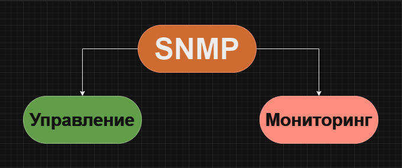
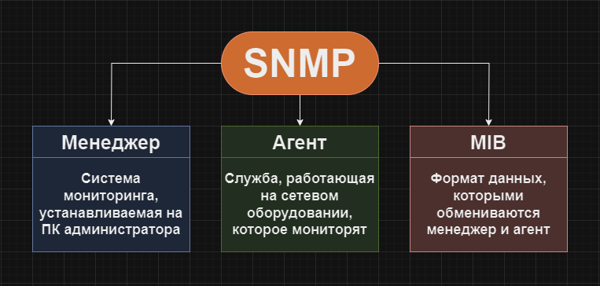
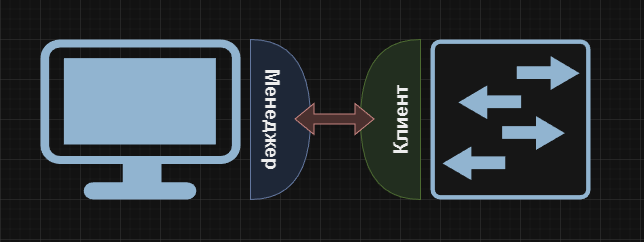
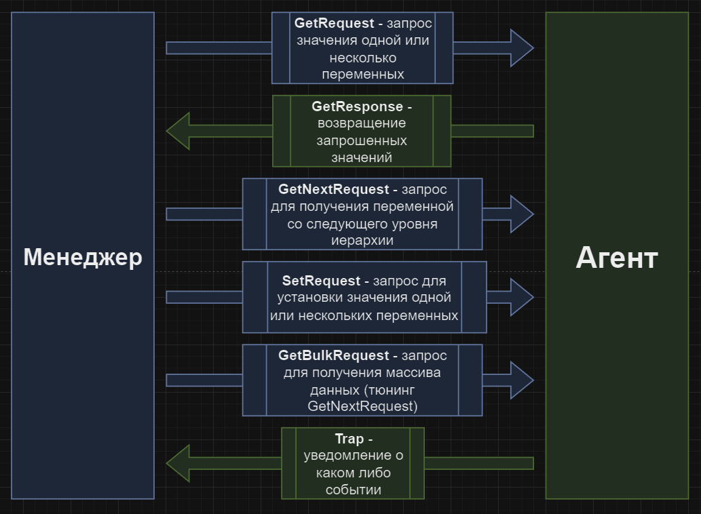
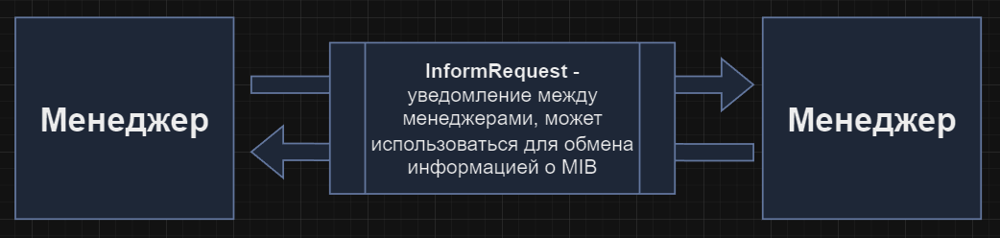

Simple Network Management Protocol - используется для мониторинга и управления сетевыми устройствами.

## Архитектура

Сеть SNMP состоит из трех компонентов:
1. **Менеджер** - система мониторинга, устанавливаемая на ПК администратора.
2. **Агент** - служба, устанавливаемая на сетевое оборудование.
3. **Management Information Database (MIB)** - формат данных, которым пользуются менеджер и агент.

## Отношения менеджера и агента

### Интерфейсы
- **Менеджер** можно рассматривать как **интерфейс между пользователем и сетевым узлом**.
- **Агент** можно рассматривать как **интерфейс между менеджером и оборудованием**, на котором он установлен.

### Клиент-сервер
Отношения менеджера и агента можно рассмотреть с точки зрения клиента и сервера:
- Большую часть времени **менеджер является клиентом**, посылая запросы агенту, который по умолчанию **слушает порт udp/161** подобно серверу.
- Однако, в SNMP существуют и так называемые **traps или notifications** - сообщения **от агента к менеджеру**, которые он подобно клиенту отправляет на порт **udp/162** менеджера. Таким образом, **иногда менеджер и агент меняются ролями**.

### Агент и MIB
Агент, работающий на сетевом оборудовании, собирает информацию об устройстве и помещает ее в значения переменных MIB.  Когда менеджер обращается к агенту, можно сказать, что он запрашивает у агента доступ к данным MIB.

## SNMP и модель OSI
- SNMP работает на 7ом уровне модели OSI
- Взаимодействие организовано при помощи PDU, содержащей ту или иную команду: на чтение переменной, запись ее значения или ответ агента
- SNMP поддерживает и TCP, однако чаще всего используется UDP
-  SNMP умеет в шифрование, в таком случае используются порты udp/10161 и udp/10162

C точки зрения OSI это выглядит следующим образом:

## SNMP PDU
Существует несколько видов PDU:

Кроме того, менеджеры могут обмениваться информацией и между собой:

## Структура PDU
Содержание обычного PDU:

- **Версия SNMP** - v1/v2/v3
- **Строка сообщества** - принадлежность к группе, Public/Private
- **Тип PDU** - цифровой идентификатор, указывающий на тип PDU (Get, GetNext и т.д.)
- **ID запроса** - идентификатор запроса, связывающий запрос и ответ.
- **Статус ошибки** - для запросов всегда 0, для ответов от 0 до 5:
	- **0 (NoError)** - нет ошибок
	- **1 (tooBig)** - объект не вмещается в один Response
	- **2  (NoSuchName)** - не существующая переменная
	- **3 (BadValue)** - при попытке установить значение задано недопустимое
	- **4 (ReadOnly)** - переменная read-only
	- **5 (GenErr)** - другие ошибки
- **Индекс ошибки** - содержит индекс, указывающий на переменную, к которой относится ошибка
- **Связанные переменные**:
	-  **Для Get** - содержит имена переменных
	-  **Для Set** - содержит имена и значения переменных
	-  **Для Response** -содержит имена и запрошенные значения

Содержание Trap PDU:

- **Фирма** - характеризует производителя оборудования
- Тип уведомления:
	- **0/1 (coldStart/warmStart)** - холодный и горячий запуск устройства соответственно
	- **2 (linkDown)** - интерфейс отключился
	- **3 (linkUp)** - интерфейс включился
	- **4 (authenticationFailure)** - менеджер выслал неверное community
	- **5 (egpNeighborLoss)** - агент потерял связь с оборудованием по протоколу EGP
	- **6 (entrpriseSpecific)** - произошло событие, характерное для производителя данного устройства

## Немного о трапах...
В SNMP есть два типа ловушек: Trap и Inform. Разница в том, что Inform требует подтверждения получения и стучится до тех пор, пока его не получит.