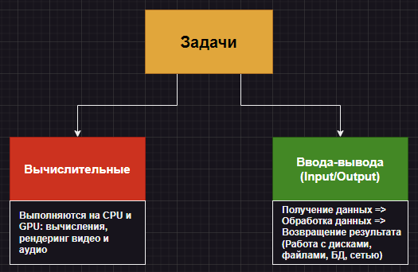

# 1. Введение

## В каком типе задач применяется асинхронность?

Существует два типа задач:



Асинхронное программирование применяется при решении второго типа задач, так как именно в них речь может идти о необходимости обслуживания нескольких клиентов в рамках одной программы.

## Из каких этапов состоит простейшая реализация сокета на Python?

```python
'''
1) Создаем объект сервер-сокета socket(): AF_INET = IPv4, SOCK_STREAM = TCP.
2) Устанавливаем опцию REUSEADDR 1, чтобы не получать кулдаун от системы после закрытия сокета.
3) Привяжем наш сервер-сокет к доменному имени и номеру порта.
4) Включаем сервер-сокет на прослушивание.
5) Так как мы не знаем, сколько именно будет длиться обмен информацией между сокетами, взаимодействие проходит в цикле while True.
6) Принимаем соединение и создаем для обработки запросов объект клиентского сокета, получаем его адрес.
7) Так как мы не знаем какое количество сообщений отправит клиент, открываем внутренний цикл while True.
8) В этом цикле смотрим в буфер через объект client_socket и ждем, пока в нем появятся данные: когда они появляются, отправляем в ответ сообщение "Hello world", закодированное в байты. Если пришел пустой запрос - рвем соединение.
'''
import socket

  
server_socket = socket.socket(socket.AF_INET, socket.SOCK_STREAM)
server_socket.setsockopt(socket.SOL_SOCKET, socket.SO_REUSEADDR, 1)
server_socket.bind(("localhost", 5001))
server_socket.listen()

while True:
    client_socket, addr = server_socket.accept()
    print('Connection from', addr)
    while True:
        request = client_socket.recv(4096)
        if not request:
            break
        else:
            response = "Hello world\n".encode()
            client_socket.send(response)
```

## Что такое блокирующая операция?

**Блокирующая операция** - это любая операция, перехватывающая контроль выполнения и блокирующая дальнейшее выполнение программы до момента возвращения контроля. По сути, в Python блокирующей операцией является любая обычная функция.

Например, в случае сокетов такими операциями будут являться `server_socket.accept()` и `client_socket.recv()`.

Первая блокирует выполнение программы до тех пор, пока не произойдет подключение клиента к сокету. Вторая блокирует выполнение программы в том случае, если буфер отправки уже заполнен.

## Как решить проблему с несколькими подключениями к одному сокету ?

Решение проблемы состоит из двух компонентов:

1. Нам нужен механизм передачи контроля выполнения куда-то в те моменты, когда наш клиент думает над ответом.
2.  Нам нужен менеджер, которому мы будем передавать контроль выполнения и который будет решать, что нам делать дальше в конкретный момент времени. Его еще называют **событийным циклом (event loop)**.

## Какими тремя способами можно писать асинхронный код без использования сторонних библиотек?

1. С помощью **колл-бэков**.
2. С помощью **генераторов и корутин**.
3. С помощью **синтаксиса async-await**.
