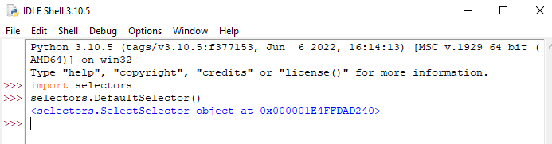

# 3. Асинхронность на коллбэках

## Зачем нужен модуль selectors? В чем его преимущество над select()?

Модуль `selectors` выполняет функции, аналогичные `select` - отслеживает события объектов. Однако, в отличие от `select`, модуль `selectors` находится на более высоком уровне абстракции и потому является платформонезависимым.

## Как при помощи модуля selectors и интерпретатора Python глянуть, какая функция занимается отслеживанием событий по умолчанию в конкретной OS?

1. Импортируем модуль.
2. Вызываем конструктор класса `selectors.DefaultSelector()` - он вернет нам название функции по умолчанию в виде `<Название_функции>Selector`



## На каких четырех компонентах основано использование модуля selectors в рамках реализации событийного цикла?

В реализации с `select()` мы вручную создавали список объектов, которые нужно мониторить, добавляли в него объекты и получали их из него.

В реализации с модулем `Selects` все эти функции на себя берет встроенный объект:

- `selector = selectors.DefaultSelector()` -  объект селектора, который занимается мониторингом событий объектов.
- `selector.register(fileobj=server_socket, events=Selectors.EVENT_READ, data=accept_connection)` - функция, регистрирующая объект `fileobj` в качестве отслеживаемого по действию, указанному в `events` и хранящая действие `data`.
- `events = selector.select()` - аналог обычного `select`, возвращающий кортеж `(key, events)`, где `key` - это `Collections.NamedTuple`, содержащий `data` и `fileobj`, который мы и будем использовать для применения методов к соответствующему объекту; `events` - битовая маска зарегистрированных событий.
- `selector.unregister(client_socket)` - функция, удаляющая объект из отслеживаемых.

## Чем должен обладать объект, чтобы его можно было передать в select?

Объект должен обладать файловым дескриптором, в терминах Python - обладать атрибутом `fileno`.

## Как будет выглядеть реализация сокета с несколькими клиентами с использованием коллбэков?

```python
import socket
import selectors


selector = selectors.DefaultSelector()

  
def server():
    server_socket = socket.socket(socket.AF_INET, socket.SOCK_STREAM)
    server_socket.setsockopt(socket.SOL_SOCKET, socket.SO_REUSEADDR, 1)
    server_socket.bind(("localhost", 5001))
    server_socket.listen()
    selector.register(fileobj=server_socket, events=selectors.EVENT_READ, data=accept_connection)

  
def accept_connection(server_socket):
    client_socket, addr = server_socket.accept()
    print("Connection from", addr)
    selector.register(fileobj=client_socket, events=selectors.EVENT_READ, data=send_message)

  
def send_message(client_socket):
    request = client_socket.recv(4096)
    if request:
        response = "Hello world\n".encode()
        client_socket.send(response)
    else:
        selector.unregister(client_socket)
        client_socket.close()
  

def event_loop():
    while True:
        events = selector.select()
        for key, _ in events:
            callback = key.data
            callback(key.fileobj)

  
if __name__ == "__main__":
    server()
    event_loop()
```

## В чем сходство и отличие реализации сокета на коллбэках от реализации на простых функциях?

Сходство в том, что мы до сих пор используем некий список объектов, которые мы мониторим на предмет соответствующего события и применяем к нему соответствующую функцию.

Отличие в том, что теперь наши объекты мониторинга связаны с соответствующими методами: теперь нам не нужно проверять тип объекта, возвращаемого `select`, чтобы понимать какой метод к ним применять.